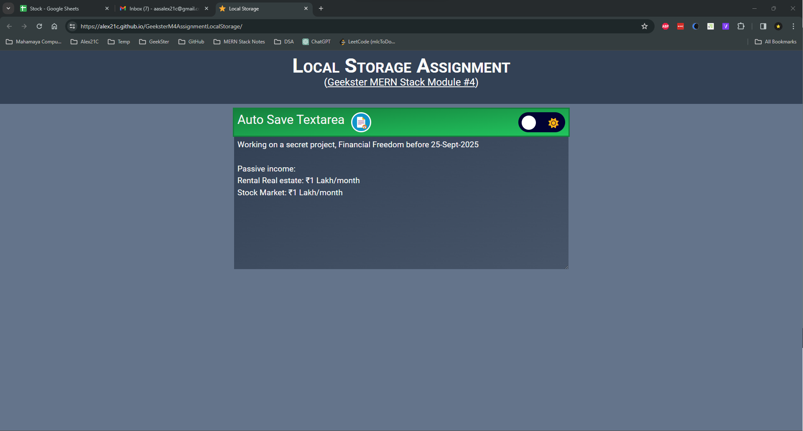

# Assignmnent, Local Storage (Geekster MERN Stack Module 4)
Local Storage is a part of HTML5 Web Storage API.
Completed Geekster Assignment for local storage, Whatever data user types in the form provided, it will be there, no matter whether user refresh the browser or closes the browser, its there !

<!--  -->

# Tech. Stack Used:
+ [Web Storage API || HTML5 Local Storage](https://developer.mozilla.org/en-US/docs/Web/API/Window/localStorage)
+ [MVC Framework](https://en.wikipedia.org/wiki/Model%E2%80%93view%E2%80%93controller)
+ [HTML5](https://en.wikipedia.org/wiki/HTML5)
+ [CSS3](https://en.wikipedia.org/wiki/CSS)
+ [Tailwind CSS](https://tailwindcss.com/)
+ [JavaScript ES6](https://en.wikipedia.org/wiki/JavaScript)
+ [Font Awesome](https://fontawesome.com/icons)
+ [Google Fonts](https://fonts.google.com/)
+ [Git](https://en.wikipedia.org/wiki/Git)
+ [GitHub](https://github.com/)
+ [VS Code](https://code.visualstudio.com/)

# Hosted Version of the Project:
[Geekster M4 Assignment&mdash;Local Storage](https://alex21c.github.io/GeeksterM4AssignmentLocalStorage/)

# Author
[Abhishek kumar](https://www.linkedin.com/in/alex21c/), ([Geekster](https://geekster.in/) MERN Stack FS-14 Batch)
